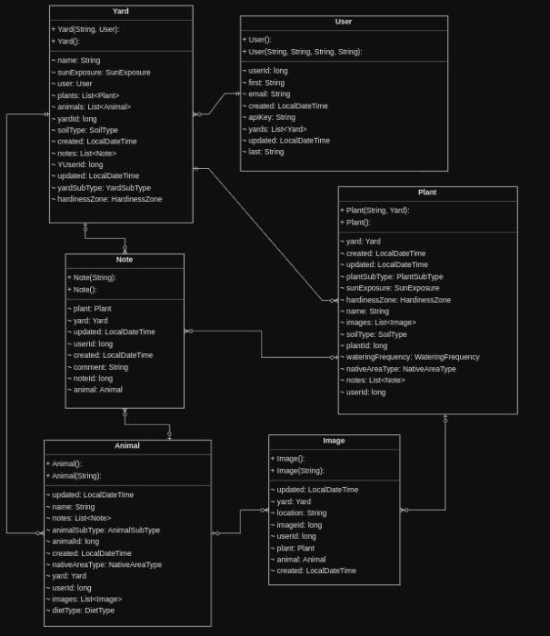

# My BackYard API
## ** This service is currently offline **
The backend API for the My BackYard application.  
* Java (21)
* Maven (3.9.5)
* Spring Boot (3.2.0)
  * starter web
  * starter data jpa
  * starter security
  * starter test
  * starter aop
  * MySQL driver
  
## Description
My BackYard is a full stack application designed to act as a handy reference for
homeowners, gardeners or even landscapers as they tend to their yards or gardens. Inspired by
my wife, who loves spending time tending to all of our various plants, there came a point where
she required some sort of note system to help her remember all the facts and notes about our
home's ecosystem.

I have designed My BackYard as a full stack application divided into a backend and
frontend components that utilizes a REST API for communication between the two components.
At this stage in the application development functionality is limited and represents only a
minimum viable product however I have placed much of my focus on a backend architecture that
will allow for growth both in scope and demand.

## Backend
The backend component of My BackYard is where I have focused the majority of work
for this application as it will be the heart and soul of the application. All business rules, or other
logic, validation, error handling, data processing, transformations, etc... will happen here in the
backend. This will allow for any form of frontend to quickly and easily be adapted to suit the
needs of the user. This is a backend-for-frontend architecture.

The backend utilizes a MySQL and Java Spring Boot stack with a model, service,
controller dataflow architecture which exposes several REST endpoints as an interface for
extracting the required data. The Maven build tool was used to coordinate dependencies and
organize test runs.

Spring data JPA and Spring web provide the bulk of the work here in the backend. JPA
for relational mapping and Web for simplifying REST controller development and interactions.
In addition to these core dependencies I also make use of Spring aspects for logging functionality
and Spring security for authentication and authorization. Unit testing is accomplished with JUnit
and Mockito via the JUnit and Spring starter test dependencies.

## Class Design
While the backend has quite a few class packages and components the base entity model
remains simple. Relying on a few many-to-one relationships to establish a relational hierarchy
between the objects: Users > Yards > Notes, Plants and Animals > Notes and Images. Here is an
ERD establishing the model class design and cardinality.

For entity design, in addition to the ID attributes required to make up the relationships
and establish PK/FKs I also make heavy use of enumerations to reduce the variability of input
for each entity. This has the benefit of reduced input validation and a reduced vulnerability
footprint.

## Data Flow
Requests will flow through several packages prior to being resolved. Data is checked for
validity, authorization, and consistency prior to egress and ingress. A typical data flow will
traverse the following path:

1. Apache Tomcat receives the request.
2. Spring Security applies a custom security filter to check for a valid API key and
   apply an appropriate authorization role.
3. The appropriate controller endpoint is assigned where a PreAuthorize mechanism
   determines if the principal's role is allowed to access the resource.
4. Incoming data such as from a POST request is projected onto a DTO record and
   handed off to the DTO processing service.
5. The DTO processing service checks the incoming data for validity where each
   field of the DTO is scrutinized against valid enumeration choices, regular
   expression patterns, and known valid values.
6. After the validity check the DTO is sent to the mapper service where it is mapped
   to the appropriate entity class that can be manipulated or persisted.
7. The DTO service then passes the newly created entity back to the controller for
   further processing.
8. The controller sends the data or request to the service package where business
   logic can be applied or the data can be passed to the data repository for
   persistence.
9. In the example of a PATCH or POST request, data is persisted to the database via
   the data repository interface.
10. Data for egress will be retrieved from the database by the repository interface at
    the direction of the service package.
11. One or more entity objects will be handed off by the service layer to the
    controller. This represents the data that will make up the reply.
12. The controller sends the entity objects to the DTO service where the mapper
    service converts the data to the appropriate DTO.
13. The controller then packages the response into an appropriate response which is
    returned to the client.

In addition to the packages traversed during normal communication a couple other
packages may come into play. All controller scope exceptions are handled by a global exception
handler and logging is handled by aspect oriented programming via pointcuts spread throughout
all the backend services.

## Frontend
The current frontend android application can be found here: https://github.com/marcuslull/MyBackYardAndroidApp

## Environment Variables
### application.properties
* `spring.datasource.url=${url}`  
* `spring.datasource.username=${db_user}`  
* `spring.datasource.password=${db_pass}`  

Current datasource is a Google Cloud SQL - MySQL database.

### sampleDataLoader.java
`@Value("${api_key_1}") String key1;`  
`@Value("${api_key_2}") String key2;`

For demo purposes you can use these keys:
* `9f9635ea_f25b_424d_87ed_1ddf8baf8ecf_1703010016526mby`
* `b55a17a7_ff28_44af_b500_b13844bb41d8_1702921958962mby`

## Deployment
1. Clone the repository to your local machine.
2. Run the Maven clean and Package lifecycles
3. Spin up a MySQL instance
4. Once the instance has been created we can configure SSL encryption
   1. Download the client certificates from your SQL instance
   2. From the command line run to convert the server-ca.pem file into a Java keystore
       file. You may be required to create a password during this step, document it, you
       will need it later when creating the Cloud Run instance.
       `keytool -importcert -file server-ca.pem -keystore truststore.jks -alias server-ca`
   3. Run the following command to combine the client key and cert into a .p12 file.
       You may be required to create a password during this step, document it, you will
       need it later when creating the Cloud Run instance.
       `openssl pkcs12 -export -inkey client-key.pem -in client-cert.pem -out client.p12`
   4. Run the following command to convert the .p12 to a Java keystore file. You may
       be required to create a password during this step, document it, you will need it
       later when creating the Cloud Run instance. `keytool -importkeystore -srckeystore client.p12 -srcstoretype PKCS12 -destkeystore keystore.jks -deststoretype JKS`
   5. Copy both keystore.jks and truststore.jks to the src/main/resources directory of the
       backend project
       1. Add exceptions for both files to your .gitignore file
5. Run the Dockerfile to create a Docker image with the appropriate dependencies
6. Start the Docker image dont forget to declare the environmental variables

The current backend is deployed to Google Cloud Run.